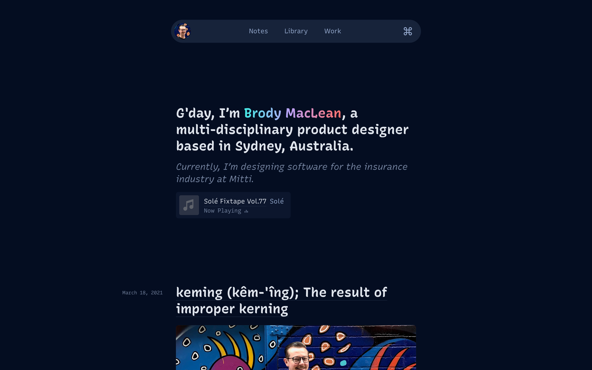

# Brody.com
[](https://app.netlify.com/sites/brody/deploys)

*Personal website powered by [Eleventy](https://11ty.io/), [Tailwind](https://tailwindcss.com/), [Netlify](https://www.netlify.com/) & 💖.*




[Visit my website →](https://brody.com) 


---

## Getting Started

### Install dependencies

```
npm install
```

### Working locally
Starts watch tasks to compile when changes detected

```
npm start
```

### Creating a production build 
Minify HTML, compress JS, inline and minify CSS.

``` 
npm run build
```
